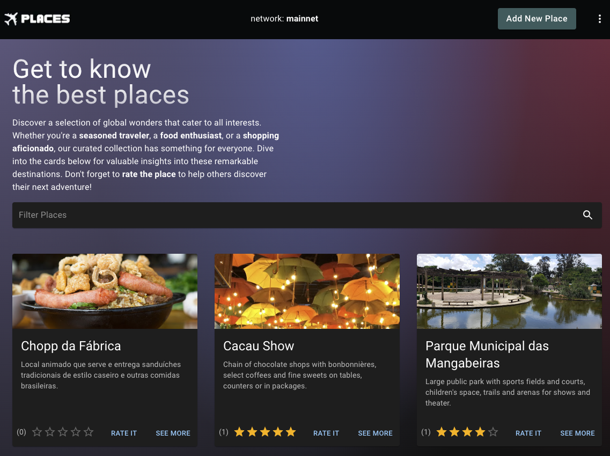

## 

Places is a DApp where the user can register places around the world, evaluate them, post feedback, consult them as well as open a map showing exactly where the place is.

**Smart Contract (backend):** [**places-near-smart-contract**](https://github.com/wpdas/places-near-smart-contract) built using **Rust** on the [**NEAR Network**](https://near.org/blockchain).

Access the live dapp here:

- [**Places DApp (mainnet)**](https://places-dapp-near.vercel.app/)
- [**Places DApp (testnet)**](https://places-dapp-near-testnet.vercel.app/)



## Development Tips

This is a [Next.js](https://nextjs.org/) project bootstrapped with [`create-next-app`](https://github.com/vercel/next.js/tree/canary/packages/create-next-app).

First, run the development server:

```bash
npm run dev
# or
yarn dev
# or
pnpm dev
# or
bun dev
```

Open [http://localhost:3000](http://localhost:3000) with your browser to see the result.

### Env vars

```sh
# API to get Countries, States and Cities: https://countrystatecity.in/
NEXT_PUBLIC_COUNTRY_STATE_CITY_API_KEY=<your country state city API key>

# NETWORK (testnet or mainnet)
NEXT_PUBLIC_NETWORK=testnet

#The smart contract ID (ID of the account where the contract was deployed)
NEXT_PUBLIC_CONTRACT_NAME=<smart contract - account id>
```
